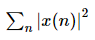
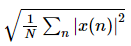
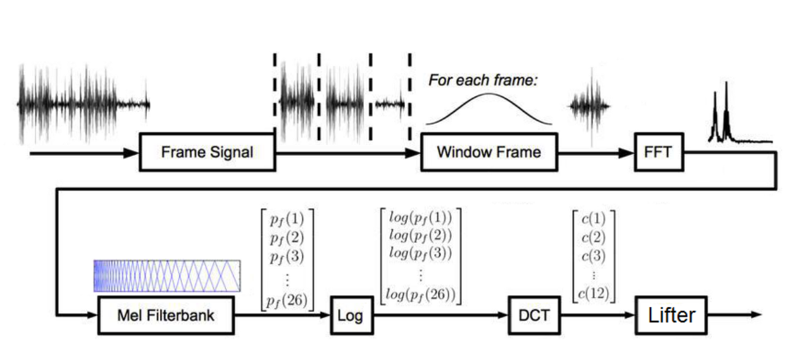
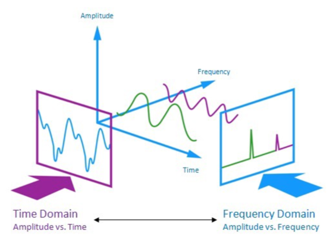

## Concept for Audio files

### What is Audio?
waveform 형태의 data(y:Amplitude, x:Time)

### ADC(Analogue Digital Conversion)
연속형 data인 audio를 digital 상에서 다루기 위해서는 입력값을 discrete한 vector로 변환시킬 필요가 있음.
- Sample rate : 초당 샘플의 개수
- Nyquist Law : 모든 신호가 그 신호에 포함된 최고 주파수의 2배에 해당하는 빈도를 가지고 일정한 간격으로 sampling 하면 원래의 신호를 완벽하게 기록할 수 있다는 법칙
- Energy : Waveform의 전체 amplitude에 대응하는 값으로 각 포인트의 진폭을 `x(n)`이라고 했을 때, 
    * RMSE(root-mean-square energy) : 
- Feature Extraction : 오디오 데이터는 여러 주파수가 섞여서 발생하므로, 신호의 성질을 잘 반영한 feature를 추출할 필요가 있음.
    * MFCCs(Mel-Frequency Cepstral Coefficients) : 오디오의 특성을 추출 하는 방법 중 하나로, Framing, Window Frame, FFT, Mel-filter bank, Logarithmic Scale, Discrete Cosine Transform, Lifter 과정
    
    * 
        + Window Frame : Windowing을 통해 나뉜 각 Frame은 Stationary state(정상상태)라는 가정을 만족시켜 시간에 의존하지 않아 에너지를 보존하고 있음. 이 때 분할로 인해 각 Frame의 신호 특성에 주는 영향을 최소화하기 위해 양쪽 경계값을 0으로 수렴시키기 위한 window function(정상분포 형태)를 곱하는 과정
            + Windowing;Framing : Time dependent하고 sequential 데이터인 음성 데이터를 하나의 phone(음절)을 갖는 짧은 구간으로 나누는 과정
        + FFT(Fast Fourier Transform) : 이산 푸리에 변환(DFT) 혹은 역변환을 고속으로 수행하는 알고리즘
            + Fourier Transform : 여러 frequency를 갖는 signal들로 구성된 waveform에서 각각의 신호를 구분하여 time domain에서 frequency domain으로 변환하고 이를 spectrum이라고 함
            
            + STFT(Short Term Fourier Transform) : 짧은 구간, 즉 Frame에 대해 푸리에 변환을 사용함으로써 Frequency domain으로 옮기면 Spectrum을 얻을 수 있고(x:frequency, y:magnitude) 이 때의 magnitude의 제곱값을 구하면 power를 얻을 수 있음. 일반적으로는 magnitude에 log scale을 적용해 데시벨(dB) 단위를 많이 사용
            + Spectrogram : STFT를 통해 각 frame의 power spectrum을 구하고 이에 log scale을 적용해 log spectrum을 구한 뒤, spectrum을 세로로 쌓아 Time domain에 대한 값으로 나타낸 것(x:time, y:frequency, pixel:amplitude;power)
            + Cepstrum : power spectrum은 모음과 같은 중요한 정보를 담고 있는데 범위가 일정하지 않아 이를 log-spectrum(dB)을 통해 균일하게 나타내어 추가적인 분석을 진행.
            사람의 목소리는 기본 주파수(F0 : fundamental frequency)와 배음(harmonics)으로 이루어진다. 기본 주파수는 정현파(사인파) 요소 중 가장 작은 주파수이고, 배음은 기본 주파수의 정수배로 발생한다. 소리가 공명되는 특정 주파수를 음형(formant)라고 하는데, 제1(F1), 제2 음형대(F2)의 주파수에 따라 모음이 달라지고 이러한 현상을 조음(articulation)이라고 한다. 하지만 공명 주파수가 배음 주파수와 어긋나면 formant를 찾기가 어렵다. 따라서 Cepstrum을 통해 F0을 구하고 이를 통해 F0의 정수배인 harmonic peak를 분리할 수 있다. Log-spectrum에 역푸리에 변환(IFFT)을 취하면 다음과 같이 Cepstrum을 구할 수 있다.
        + Mel-Filter Bank : 사람의 청력은 1000Hz 이상의 frequency에 대해서는 덜 민감하므로 1000Hz까지는 Linear하게 그 이상은 Log scale로 변환하는 Mel-Filter를 적용해 Mel scale로 변환한다. 보통 26개 혹은 40개 정도의 filter bank를 사용한다. 각 Filter Bank 영역대 마다 Energy값(spectrum power값 평균)을 모두 합하고 log를 취해준다. 이렇게 주파수 영역뿐만 아니라 amplitude 영역에서도 log scaling을 해주는 이유는 사람이 주파수 영역뿐만 아니라 amplitude 영역에서도 log scale로 반응하기 때문이다. 이렇게 하면 결과적으로 filter bank 개수만큼의 Mel scale bin 별로 log power 값들이 구해진다.
        + DCT(Discrete Consine Transform) : DCT는 특정 함수를 cosine 함수의 합으로 표현하는 변환이다. 이때 앞쪽(low) cosine 함수의 계수가 변환 전 데이터의 대부분의 정보를 가지고 있고 뒤쪽으로 갈수록 0에 근사해 데이터 압축의 효과를 보인다. 즉 낮은 주파수 쪽으로 에너지 집중현상이 일어난다.